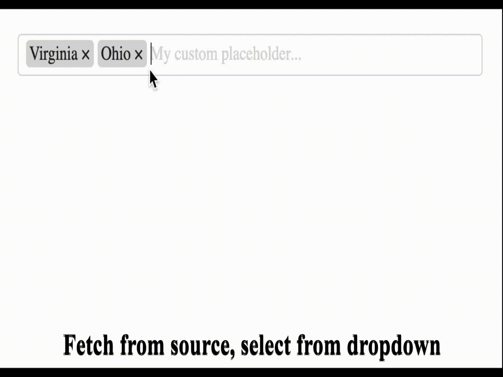

# Tagelect.js

Simple and neat tag input element that allows you to enter new tags,
performs auto-completion fetching from specified source and has tag validations.



# Key features 📦
* Allow user to add 🆕 and remove ❌ tags
* Can have an auto-complete 🔎 from source
* Tab-completes 👉 the first suggestion from source
* Has validations 🛡 for duplicate tags, maximum allowed tags and tag format
* Has a default set of CSS style rules 🎨, but custom class names can be specified

# Getting started 🏄‍♀️

## Install package

With NPM:
```shell
npm install tagelect
```

With Yarn:
```shell
yarn add tagelect
```

# Usage 🕵️‍♀️

`Tagelect` can be initialized with options or without giving any options.

## Without any options
```javascript
  import Tagelect from 'tagelect';
  import 'tagelect/dist/tagelect.min.css';

  const myInput = document.getElementById('my-input');
  new Tagelect(myInput);
```

## With options
```javascript
  import Tagelect from 'tagelect';
  import 'tagelect/dist/tagelect.min.css';

  const myInput = document.getElementById('my-input');
  // These are the default options.
  // You should specify only the ones you want to change.
  const options = {
    maxTags: undefined,
    maxTagsError: "can't contain more than %TAGS% tags",
    validationRegex: undefined,
    validationRegexError: 'permitted characters used',
    noDuplicates: false,
    noDuplicatesMessage: 'duplicates are not allowed',
    placeholder: 'Enter a tag...',
    removeButton: true,
    tagDelimiter: ',',
    suggestionsCount: 5,
    suggestionHeaders: () => ({}),
    suggestionsSource: null,
    classNames: {
      wrapper: 'tagelect',
      container: 'tagelect-content',
      tagInput: 'tagelect-input',
      tag: 'tagelect-tag',
      removeButton: 'tagelect-tag-remove-btn',
      tagText: 'tagelect-tag-text',
      dropdown: 'tagelect-dropdown',
      dropdownItem: 'tagelect-dropdown-item',
      dropdownItemSelected: 'tagelect-dropdown-item--selected',
      error: 'tagelect-error'
    }
  }

  new Tagelect(myInput, options);
```

### Options
| Option               | Type     | Description                                               |
| -------------------- | -------- | --------------------------------------------------------- |
| maxTags              | Number   | if set validates that up to the number of tags only       |
| maxTagsError         | String   | validation message for max. tags validation               |
| validationRegex      | Regex    | if set validates that new tags match the regex            |
| validationRegexError | String   | validation message for tag regex validation               |
| noDuplicates         | Boolean  | if true, duplicates tags are not allowed                  |
| noDuplicatesMessage  | String   | validation message for duplicate tags validation          |
| placeholder          | String   | placeholder for the tag input                             |
| removeButton         | Boolean  | if true, tags have a remove button                        |
| tagDelimiter         | String   | delimiter used to read or write to input value            |
| suggestionsCount     | Number   | number of suggestions that are fetched from source        |
| suggestionHeaders    | Function | func. returning headers to send when fetching suggestions |
| suggestionsSource    | String   | if set, enables the fetching of suggestions from this URI |
| classNames           | Object   | can be used to set custom classes for various elements    |

# CSS customization

`Tagelect` can be initialized with custom CSS classes (by providing the [classNames](#with-options) option),
but you can also use the default CSS classes and re-assign the CSS variables with your own colors to match your color scheme.

These are the default variable values:

```css
  --tagelect-text-color: #232323;
  --tagelect-bg-color: white;
  --tagelect-border-color: #d9d9d9;
  --tagelect-tag-bg-color: #d9d9d9;
  --tagelect-placeholder-color: #d9d9d9;
  --tagelect-remove-btn-color: #232323;
  --tagelect-remove-btn-hover-color: #ea0000;
  --tagelect-dropdown-bg-color: white;
  --tagelect-dropdown-text-color: #232323;
  --tagelect-dropdown-border-color: #d9d9d9;
  --tagelect-dropdown-hover-color: #232323;
  --tagelect-dropdown-hover-bg-color: #e3e3e3;
  --tagelect-suggestion-color: #d9d9d9;
```
